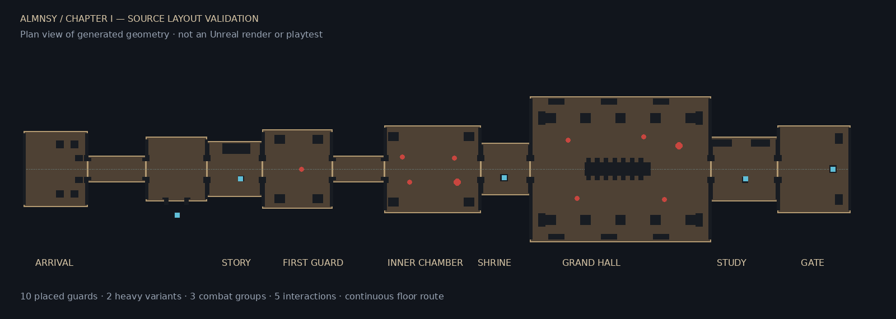

# ALMNSY — Chapter I: The House That Remembers

**v03 refinement:** see [the implementation and testing report](Documentation/Level01/v03/README_v03.md).
Run `Scripts/BuildAndOpen_v03.ps1` to generate/open the separate experiment. The
user-verified v02 assets and startup configuration are preserved. v03 still needs
local UE 5.8 compilation, generation and playtesting. The original v01 instructions
below are retained as implementation history.

**Implemented source + automated editor assembly for the existing UE 5.8 project.**
The editor has not been run in the authoring environment. This is not a claim of
a compiled, packaged or playtested game. The map and new `.uasset` files are
created locally by the builder; the repository contains their source and assembly.

## Open and play

1. Pull this repository. Close Unreal Editor before the first C++ build.
2. In PowerShell, from the repository directory, run:

   ```powershell
   .\Scripts\BuildAndOpen_Level01.ps1
   ```

   If Unreal is not in a detected location:

   ```powershell
   .\Scripts\BuildAndOpen_Level01.ps1 -EngineRoot "D:\Epic Games\UE_5.8"
   ```

3. Let the C++ build, asset generation, navigation and shader compilation finish.
   The script opens the generated map. Press **Play → Selected Viewport** and
   use **Default Player Start**, not “Current Camera Location”.

The project requires the C++ toolchain used by the supplied UE 5.8 template
(Visual Studio with the Unreal C++ workload and Windows SDK). No paid assets,
other projects, Blender, pip packages or third-party plugins are required.

Alternative when the Editor target is already compiled: open
`ALMNSY_Level01.uproject`, save any dirty work, then **Tools → Execute Python
Script**, selecting `Scripts/Build_ALMNSY_Level01.py`.

Generated map:

```text
/Game/ALMNSY/Levels/Level01/ALMNSY_Level01_FirstPlayable_v01
```

After successful generation, startup map entries are updated in `DefaultEngine.ini`.
The generated map has its own game mode override; template maps and Blueprints
remain available. Restart the editor once if its startup-map settings are cached.

## Implemented chapter

Arrival courtyard → entry passage → ruined memory chamber and optional toy alcove
→ story figure → sword acquisition → first guard → inner passage → combat chamber
→ memory lamp checkpoint → grand ceremonial hall → quiet study → story gate.

- Eleven connected spaces on a continuous floor, with a short optional side room.
- An unarmed start; the figure says **«لقد كبرت» / “You have grown.”**
- Ten preplaced guards: eight standard, two heavy; encounters of 1, 4 (spaced
  pairs), then 5. The hall includes four standard guards and one heavy.
- Health, a buffered three-attack sequence, invulnerability after damage,
  hit reaction, enemy death, sprint and a short evade.
- Line-of-sight detection, navigation-based pursuit, a leash, fixed-heading
  attack windup, recovery periods and a warm light tell before enemy strikes.
- Melee sweeps only during the attack window, one hit per actor per swing,
  visibility checks to prevent damage through walls, and impulses on physics props.
- Persistent save snapshots at the start, weapon acquisition, memory shrine and
  study clue. Death reloads the map: saved fallen guards remain gone; unsaved
  guards and props reset. The shrine restores health; a kill restores 12 HP.
- Visible physical doors unlock from encounter, weapon or memory conditions.
  The final interaction requires the hall cleared and the study clue found.
- Short final subtitle, fade to black, chapter completion and restart controls.
- Native UMG health/objective/interaction/subtitle/pause/completion presentation.

## Environment and presentation

- A **62 × 50 metre, 16.5 metre high** ceremonial hall, pointed arcades, carved
  pillars, clerestory openings, hanging cloth, framed wall art and bronze details.
- A central 22 metre table with fourteen chairs, candles, a burgundy runner,
  plates, goblets and bowls. **31 separate physics props** use simple convex
  collision and ignore camera collision. Major furniture has solid collision.
- Nineteen original procedural meshes, editable JSON and OBJ sources, seventeen
  512px texture images and four original synthesized sound placeholders.
- Stone, limestone, dark wood, burgundy cloth, patterned carpet, bronze, ceramic,
  parchment and painting materials, including surface roughness variation.
- Repeated architecture uses hierarchical instancing. Open arches use their
  actual triangles for collision, rather than a convex hull across the doorway.
- Warm practical lights, cool rectangular fills, moonlight, restrained fog,
  emissive flames and a distant architectural silhouette beyond the final gate.
- Software Lumen and Virtual Shadow Maps. Hardware ray tracing is disabled to
  avoid making it a requirement. Performance has **not** been measured.



## Controls

| Action | Keyboard / mouse | Gamepad |
| --- | --- | --- |
| Move / camera / jump | WASD / mouse / Space | Template sticks / A |
| Attack / queue next attack | Left mouse | Right shoulder |
| Interact | E | X |
| Evade | Left Ctrl | B |
| Sprint | Hold Shift | Not mapped in this pass |
| Pause / resume | Esc | Menu |
| Reload checkpoint | R while paused | Keyboard required |
| Reset save / new chapter | N while paused or after completion | Keyboard required |

Keyboard/gamepad prompts are first-pass English. The important Arabic line is
kept as Unicode in a UMG text block. Arabic font fallback/shaping needs local
visual inspection. No recorded voice, full localization or final soundtrack.

## First-pass limitations

- Player and guards use the supplied Manny mesh. Guards receive simple material
  differentiation; the heavy has a larger visual scale. These are placeholders.
- Locomotion uses the supplied blend space with the speed axis resolved by name.
  Attack, fall, hit and death sequences are reused from this repository. Attack
  animations are **unarmed template motions with a temporary sword**, not final
  sword choreography. Socket alignment and contact timing need editor tuning.
- Single-node animation switching is functional source scaffolding, with less
  blending than a final Animation Blueprint. No foot IK, lock-on, stamina,
  authored dodge animation or heavy player attack is implemented.
- The sword's combat volume is a timed forward sweep, not per-frame blade-edge
  tracing. The NPC interaction is subtitle/weapon staging, not a cinematic.
- Tableware moves and falls; **destruction/breakage is not implemented**.
- The audio is simple synthesis, not final foley. Cloth is a shaped static mesh;
  cloth simulation, dust particles, advanced memory VFX and animated flames
  are not implemented.
- The 20–35 minute playtime remains a **design target, not a measured result**.
  This first pass may be considerably shorter. No filler or artificial waits
  were added to make an unverified playtime claim.
- No visual fidelity, stable frame rate or commercial-release readiness is
  claimed before inspecting the actual Unreal result.

## Verified here

Run `python Scripts/Level01/validate_sources.py` to reproduce the checks.
The core checks require only Python's standard library; Pillow is optional for
the two documentation previews and is not required by Unreal's builder.

- Python syntax for all scripts and `git diff --check`.
- Mesh indices, finite coordinates, UV counts and non-degenerate triangles.
- Original hardcoded content references exist in this exact repository.
- Guard identities are unique and progression gates do not require enemies
  located beyond the gate they unlock.
- A conservative 50cm standing-height collision-grid flood fill derived from
  the **actual assembly functions** reaches all guard positions, checkpoint
  spawn points and interaction approaches, including the optional alcove.
- Physics props are assigned simple convex source collision.

See `Documentation/Level01/StaticValidation.json`. These checks do **not**
execute Unreal, compile C++, validate every reflected Python API or replace
Chaos/NavMesh/PIE tests. The plan and material palette are source previews.

## Requires local Unreal validation

1. Build the Editor target. Resolve any engine-version API/compiler errors first.
2. Run the builder. Confirm its success log and `Saved/ALMNSY/Build_v01.json`.
   A map existing by itself does not prove generation finished.
3. Allow navigation to rebuild; press P in the editor to inspect traversable
   ground. Verify guards navigate around the hall table and columns.
4. Play the entire route, including sword acquisition, both physical encounter
   doors, shrine, study clue and final completion.
5. Die before and after shrine activation. Close and reopen the map to check the
   persisted checkpoint. Test R/N from pause and N after completion.
6. Hit tableware and inspect sword alignment, hit timing, falling, player/camera
   collision and Arabic text. Tune exposure and shadow cost on the target PC.
7. Package a Development build and run the same route outside PIE. The
   `DirectoriesToAlwaysCook` entries include dynamically loaded chapter/input
   assets, but cook/package success has not been tested here.

## Versioning and recovery

The builder never overwrites existing chapter meshes, materials or Blueprints.
An existing map is opened without changes. It also refuses to switch away from
unsaved work. No other ALMNSY repository is required or modified.

For a separate map iteration, set this before invoking the setup script:

```powershell
$env:ALMNSY_BUILD_VERSION = 'v02'
.\Scripts\BuildAndOpen_Level01.ps1
```

This creates a new map while sharing the existing generated kit. If generation
fails partway through, the error is logged and no success report is written.
Keep that partial map for inspection and use the next version after correcting
the reported failure. A rerun does not silently destroy or overwrite it.

Source regeneration: `python Scripts/Level01/generate_sources.py` rewrites only
this generator's deterministic `SourceArt/Level01` outputs. It does not overwrite
Unreal assets. For art revisions, version the asset names as well as the map.

## Where to refine next

The first required pass is a local compile/generation/playtest, followed by
exposure and combat tuning. Then replace unarmed attack sequences with real
sword animations, improve transitions, refine the stone/carpet kit and localized
UI, and measure encounter duration and target-machine performance.

Editor automation follows Epic's [Python editor scripting API](https://dev.epicgames.com/documentation/en-us/unreal-engine/python-api/)
and [UStaticMesh authoring API](https://dev.epicgames.com/documentation/unreal-engine/API/Runtime/Engine/UStaticMesh).
